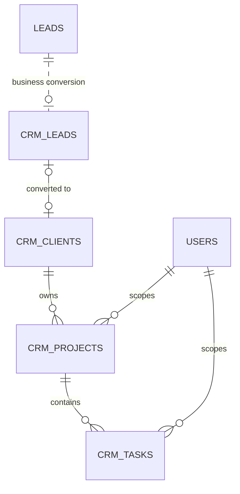

# Phase 5 Task Management Design
## Overview
Phase 5 adds project-scoped tasks inside the existing CRM module. The approved lifecycle remains **Website Lead → CRM Lead → Client → Project → Task**; existing intake, conversion, and project creation behavior is unchanged, and the Website Lead → CRM Lead transition remains a business transition rather than a new foreign key.
Tasks belong only to one owned project. This phase supports create, list, edit, complete/reopen, and delete; it excludes direct lead/client/contact/company ownership, global task lists, assignment, due dates, descriptions, priority, labels, ordering, comments, subtasks, time tracking, audit history, and a single-task read endpoint. Completion is one boolean.
## Architecture

All behavior stays in `apps/api/src/modules/crm`. The existing authenticated `projectsRouter`, JWT middleware, validation, async `handle`, `AppError`, global error handler, and CRM repository/service patterns are reused. There is no `modules/tasks`, new router export, generic task abstraction, or `app.js` change.
Create exactly one implementation file: `database/supabase/migrations/20260715000007_create_crm_tasks.sql`. Modify only `crm.repository.js` (owner/project-scoped queries), `crm.service.js` (allowlists, ownership, not-found/conflict handling), and `crm.routes.js` (four nested routes). Estimated implementation is 140–169 lines: SQL 12–14, repository 55–65, service 45–55, routes 28–35; the target remains under approximately 200 implementation lines, excluding tests.
## Components and Interfaces
| Method | Project-nested endpoint | Body | Success | Contract |
|---|---|---|---|---|
| GET | `/api/projects/:projectId/tasks` | — | `200 { success, data }` | Verify the owned project; list only owner- and project-scoped tasks. |
| POST | `/api/projects/:projectId/tasks` | `{ name: string }` | `201 { success, data }` | Accept only a trimmed, nonblank name; create with `completed=false`. |
| PATCH | `/api/projects/:projectId/tasks/:taskId` | `{ name?: string, completed?: boolean }` | `200 { success, data }` | Require at least one allowed field; reject unknown fields and re-parenting. |
| DELETE | `/api/projects/:projectId/tasks/:taskId` | — | `200 { success: true }` | Delete only the matching owned project task. |
Repository operations are `ownedProjectExists` plus project-scoped list/create/update/delete queries. Service operations reuse `nameValues`, enforce the patch allowlist, and translate project-delete conflicts. Routes extend only `projectsRouter`; no bulk, standalone `/api/tasks`, or global list interface is introduced.
## Data Models
```sql
create table public.crm_tasks (
  id uuid primary key default gen_random_uuid(),
  owner_user_id uuid not null references public.users(id) on delete cascade,
  project_id uuid not null references public.crm_projects(id) on delete restrict,
  name text not null check (btrim(name) <> ''),
  completed boolean not null default false
);
create index crm_tasks_project_id_idx on public.crm_tasks (project_id);
alter table public.crm_tasks enable row level security;
```
The model has exactly five columns. `owner_user_id` preserves direct CRM tenant isolation, `project_id` is the sole non-null parent, `name` stays consistent with Companies, Clients, and Projects, and `completed` is the minimum real task workflow state rather than future-proofing. The project-only index is sufficient because project IDs are globally unique and narrow each lookup to one project’s task set; `owner_user_id` remains an explicit security predicate on every query. No timestamps, trigger, policy, helper function, uniqueness rule, or ordering column is added. Project deletion is restricted until its tasks are deleted.
## Correctness Properties
### Property 1: Tenant and project isolation
For every authenticated user and project, listing returns only tasks whose `owner_user_id` equals the JWT subject and whose `project_id` equals the path project. Every create first verifies project ownership; every list/update/delete constrains owner and project, and update/delete also constrain task ID.

**Validates: Requirements 1.1, 4.1, 5.1, 9.1**
### Property 2: Valid, immutable task ownership
Every created task has a trimmed, nonblank name, `completed=false`, and immutable `owner_user_id`/`project_id`; patch changes only supplied `name` and/or `completed` fields.

**Validates: Requirements 3.1, 4.1, 5.1**
### Property 3: Safe mismatch and deletion behavior
A task addressed through a different project is not found, and deleting a project containing tasks never silently deletes those tasks.

**Validates: Requirements 4.1, 9.1**
### Property 4: Deliberately unconstrained values
Duplicate names and unspecified list order are valid; no behavior depends on uniqueness, timestamps, or ordering.

**Validates: Requirements 1.1, 3.1, 9.1**
## Error Handling
`AppError` and the global handler return `400` for blank, empty, mistyped, extra, or forbidden fields; existing `401` responses for missing/invalid JWT; `404 PROJECT_NOT_FOUND` for an inaccessible project; `404 TASK_NOT_FOUND` for a missing or mismatched project task; and `409 PROJECT_HAS_TASKS` when the restrictive foreign key blocks project deletion. No response reveals cross-owner resource existence.
## Testing Strategy
1. Apply the single migration; verify five columns, one `project_id` index, RLS enabled, restrictive project FK, and no policy/trigger/helper.
2. Use existing flows to create the lead-to-project chain, create a task as owner A, and verify `completed=false`.
3. List two owned projects and verify task isolation; patch name, complete, and reopen, verifying persistence.
4. Verify create rejects blank/extra fields and patch rejects empty bodies, blank names, wrong boolean types, ownership/parent fields, and unknown fields.
5. As owner B, attempt all four operations with owner A IDs and verify `404` with no data leak.
6. Address a real task through another project and verify `TASK_NOT_FOUND` with no mutation.
7. Verify project deletion returns `409 PROJECT_HAS_TASKS`, then succeeds after task deletion.
8. Verify JWT behavior is unchanged, no `/api/tasks` route exists, and existing tests pass once in non-watch mode.