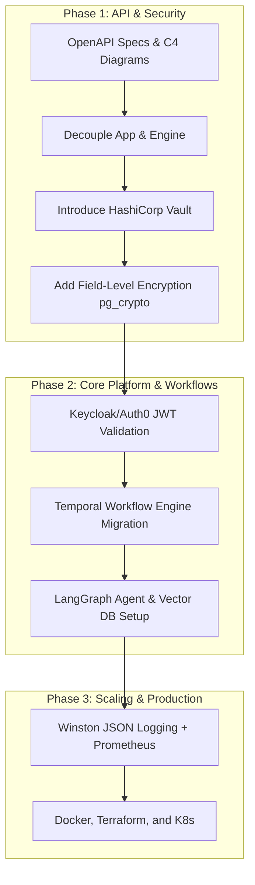

# JARVIS PRIME — Enterprise Migration Guide

This guide provides a step-by-step technical roadmap to transition the current Jarvis Prime bootstrap MVP into the target enterprise architecture.

---



---

## Phase 1: Product & System Architecture (decoupling & specs)

Before modifying code, formalize service boundaries and document API interactions.

1. **Document OpenAPI Specifications**:
   * Create an OpenAPI 3.0 specification file (e.g. `openapi.yaml`) mapping every route in `engine/src/api/routes/` (`/api/analytics`, `/api/linkedin`, `/api/calendar`, `/api/scheduler`).
   * Explicitly define parameter schemas, auth headers, and response shapes.
2. **Design C4 Architecture Diagrams**:
   * Create C4 Context and Container diagrams showing the interactions between the Next.js Frontend, Express API, Temporal Workers, Supabase Database, Redis, and External APIs (Apollo, LinkedIn, Twilio, Resend).
3. **Decouple App and Engine**:
   * Ensure `apps/site` strictly communicates with the engine via authenticated HTTP calls, removing any shared file-system dependency.

---

## Phase 2: Secrets Management & Database Encryption

Move away from plain-text configurations and secure sensitive customer tokens (e.g. LinkedIn cookies, email API keys).

1. **Introduce HashiCorp Vault or Infisical**:
   * Install and configure Vault in your local environment.
   * Modify [config.js](file:///Users/anujsingh/Jarvis%20ai%20company/engine/src/config.js) to resolve credentials from Vault's transit engine at runtime rather than `process.env`.
2. **Implement Database Field-Level Encryption**:
   * In [schema.sql](file:///Users/anujsingh/Jarvis%20ai%20company/engine/sql/schema.sql), alter columns storing API credentials (such as client LinkedIn cookies or Resend keys) to use the `pgcrypto` extension.
   * Update [db.js](file:///Users/anujsingh/Jarvis%20ai%20company/engine/src/lib/db.js) to call postgres encryption functions (`pgp_sym_encrypt` and `pgp_sym_decrypt`) when writing and reading client records.

---

## Phase 3: Identity & Multi-Tenancy

Replace static token authentication with JWT validation and isolate customer data.

1. **Integrate Keycloak or Auth0**:
   * Setup a Keycloak instance. Create realms for Administrators and Client users.
2. **Implement JWT Validation Middleware**:
   * Replace the legacy static authentication function in [runner.js](file:///Users/anujsingh/Jarvis%20ai%20company/engine/src/runner.js#L193-L199) with a JWT token parser middleware.
   * Use library like `jsonwebtoken` and `jwks-rsa` to verify signatures against Keycloak's public keys.
3. **Enable Row-Level Security (RLS)**:
   * Define Postgres tenant views or enforce matching `tenant_id` (or `client_id`) on all operations. Enable Postgres RLS policies:
     ```sql
     ALTER TABLE public.prospects ENABLE ROW LEVEL SECURITY;
     CREATE POLICY tenant_isolation ON public.prospects 
       USING (client_id = current_setting('app.current_client_id')::uuid);
     ```

---

## Phase 4: Scaling the Database & Cache (Redis)

Optimize database query execution and manage transient states.

1. **Setup Redis**:
   * Add Redis to store session caches and token configurations.
2. **Implement Distributed Rate Limiting**:
   * Replace the in-memory rate limiter in [runner.js](file:///Users/anujsingh/Jarvis%20ai%20company/engine/src/runner.js#L226-L251) with a Redis-backed token bucket algorithm (e.g., `rate-limiter-flexible`). This prevents rate-limit failures when scaling Express across multiple instances.

---

## Phase 5: Transition Schedulers to Temporal & BullMQ

Replace the 150-line cron utility with a robust, fault-tolerant workflow orchestrator.

1. **Setup Temporal**:
   * Install Temporal locally using Docker Compose.
2. **Translate Campaigns to Temporal Workflows**:
   * Define campaigns as Temporal Workflows (`outreachWorkflow`).
   * Translate campaign sequence steps (email creation, sending, LinkedIn tasks) into Temporal Activities (`SendEmailActivity`, `LinkedInVisitActivity`).
   * Leverage Temporal's native timers (`workflow.sleep()`) to handle day-long sequence delays. If the worker crashes, Temporal resumes exactly where it stopped.
3. **Implement Retries and Backoffs**:
   * Set retry policies on activities to handle network timeouts automatically (e.g., Apollo API limits or Resend failures).

---

## Phase 6: AI Agent Platform (LangGraph & Vector DB)

Move away from simple LLM calls and introduce structured agent state machines.

1. **Adopt LangGraph**:
   * Install `langgraph` in the engine.
   * Translate the outbound qualification logic into a directed agent graph:
     `Sourced Lead` $\rightarrow$ `Scrape tech-stack` $\rightarrow$ `Evaluate against ICP schema` $\rightarrow$ `Write personalized lines` $\rightarrow$ `Validate output compliance` $\rightarrow$ `Approved/Disqualified`.
2. **Setup a Vector Database**:
   * Configure pgvector in Supabase or set up an instance of Pinecone.
   * Embed client case studies, guidelines, and value propositions into vectors.
3. **Implement Dynamic RAG for Emails**:
   * Modify [personalizer.js](file:///Users/anujsingh/Jarvis%20ai%20company/engine/src/ai/personalizer.js) to perform a vector search before calling Groq/OpenAI, appending relevant client case studies to the prompt to make cold emails highly contextual.

---

## Phase 7: Enterprise Integration Platform (OAuth2 flow)

Enable secure, standard integrations for clients.

1. **Create OAuth2 Callbacks**:
   * Create routes in `engine/src/api/routes/` to handle OAuth authorization code flows for Google (Gmail/Calendar) and Microsoft (Outlook/365).
   * Securely store authorization and refresh tokens inside the encrypted Supabase database.
2. **Sync CRM Data Bidirectionally**:
   * Implement event-based sync listeners: when a prospect stage transitions to `replied` or `booked` in `db.js`, trigger webhooks to HubSpot/Salesforce APIs to update deals automatically.

---

## Phase 8: Production Monitoring & ELK Stack

Replace simple logs with centralized, searchable system metrics.

1. **Implement Structured JSON Logging**:
   * Replace `console.log` in [logger.js](file:///Users/anujsingh/Jarvis%20ai%20company/engine/src/lib/logger.js) with a structured JSON logger (e.g. `winston` or `pino`).
   * Configure logger transports to send logs to Grafana Loki or ELK.
2. **Expose Prometheus Metrics**:
   * Integrate `prom-client` in Express to expose metrics like:
     * `http_requests_total`
     * `outreach_emails_sent_total`
     * `active_workflow_runs`
     * `linkedin_actions_failed`
   * Build a Grafana dashboard to visualize these metrics.

---

## Phase 9: Infrastructure as Code (Docker + K8s + Terraform)

Scale deployment and operational orchestration using configuration scripts.

1. **Write Dockerfiles**:
   * Build container configurations for both the web frontend (`apps/site`) and the automation engine backend (`engine/`).
2. **Write Terraform Configurations**:
   * Write Terraform manifests (`main.tf`, `variables.tf`) to provision AWS resources (EKS Kubernetes Cluster, RDS PostgreSQL Instance, ElastiCache Redis).
3. **Create Kubernetes Manifests & Helm Charts**:
   * Write deployment manifests for backend Express servers, Temporal Workers, and PostgreSQL database migrations.
   * Set up Horizontal Pod Autoscaling (HPA) to scale backend pods based on CPU/Memory usage.
