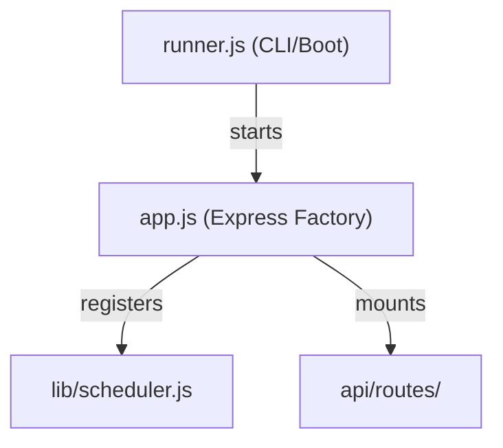

# JARVIS PRIME Engine Architecture Guide

This guide provides a detailed, file-by-file breakdown of the **JARVIS PRIME v3.0 Outbound Automation Engine**. It explains **what** each file does, **why** it is used, and **where** it integrates into the broader system.

---

## 1. Bootstrapping & Entry Points

These files orchestrate the server and command-line interfaces.



### [runner.js](../../engine/src/runner.js)
* **What it does**: The primary entry point for execution. It handles dual-mode startup: either starting the HTTP API server or executing specific command-line (CLI) jobs (sourcing, outreach, reply simulation).
* **Why it's used**: It acts as the bridge between execution environments (like Docker/Kubernetes, local terminals, or cron schedules) and the application logic. It also handles graceful shutdowns (`SIGTERM`/`SIGINT`) to drain active connections.
* **Where it's used**: Called directly when starting the engine (`npm run server` or `npm run source`).

### [app.js](../../engine/src/app.js)
* **What it does**: The Express Application Factory. It configures basic middleware (CORS, rate limiting, logging), registers health probes, mounts public/private API routes, and initiates the background scheduler.
* **Why it's used**: By separating the server configuration from the listen socket, it allows testing tools to import the application without launching network listeners.
* **Where it's used**: Imported by [runner.js](../../engine/src/runner.js) to start the server, and by integration tests to mock requests.

### [config.js](../../engine/src/config.js)
* **What it does**: Loads all environment variables (`.env`) with safe defaults, parses them into typed configurations, and exposes the helper `getClientConfig(client)` to merge client database configurations with engine defaults.
* **Why it's used**: Prevents hardcoded variables. Centralizes credentials, limits, and scoring parameters.
* **Where it's used**: Imported by virtually every file that makes external API calls, accesses databases, or enforces limits.

---

## 2. Middleware Layer (`engine/src/middleware/`)

Middleware files intercepts incoming HTTP requests to handle cross-cutting concerns (security, logging, validation).

### [cors.js](../../engine/src/middleware/cors.js)
* **What it does**: Handles Cross-Origin Resource Sharing. It controls which web origins (domains) are allowed to communicate with your backend API.
* **Why it's used**: Secures the API from unauthorized browser-based requests. Supports wildcard development modes and regex matching for subdomains.
* **Where it's used**: Mounted globally in [app.js](../../engine/src/app.js) for all HTTP routes.

### [rate-limiter.js](../../engine/src/middleware/rate-limiter.js)
* **What it does**: Counts requests from specific IPs or Client IDs and blocks clients that make too many requests within a window (e.g., max 100 requests per minute).
* **Why it's used**: Protects the API from denial-of-service (DoS) attacks and brute-force attempts.
* **Where it's used**: Mounted globally in [app.js](../../engine/src/app.js).

### [request-logger.js](../../engine/src/middleware/request-logger.js)
* **What it does**: Generates a unique `requestId` (UUID) for every incoming request, appends it to headers, and logs request parameters (method, path, latency, status code).
* **Why it's used**: Essential for production debugging. When an API call fails, the `requestId` allows developers to track logs associated with that specific execution path.
* **Where it's used**: Mounted globally in [app.js](../../engine/src/app.js).

### [authenticate.js](../../engine/src/middleware/authenticate.js)
* **What it does**: Restricts access to the API routes. Validates incoming requests by checking for the `x-automation-secret` header or a Bearer token matching `AUTOMATION_SERVER_SECRET`.
* **Why it's used**: Ensures that only authenticated services (like your Next.js frontend or cron workers) can trigger pipeline execution.
* **Where it's used**: Mounted as a boundary in [app.js](../../engine/src/app.js) before all `/api/*` subroutes.

### [client-scope.js](../../engine/src/middleware/client-scope.js)
* **What it does**: Extracts client identities from incoming headers or query parameters and binds `req.clientId`.
* **Why it's used**: Prepares the engine for multi-tenant isolation, ensuring that database queries downstream filter only resources owned by the active client.
* **Where it's used**: Mounted alongside API routes where customer data separation is required.

### [validate.js](../../engine/src/middleware/validate.js)
* **What it does**: Validates request body payloads against a schema definition (verifies data types and required/optional fields).
* **Why it's used**: Prevents processing corrupt data and guards against SQL injection, crashing, or incomplete model states.
* **Where it's used**: Implemented on POST/PUT endpoints inside API route files.

### [error-handler.js](../../engine/src/middleware/error-handler.js)
* **What it does**: Catches unhandled errors, logs them using the structured logger, and formats error responses cleanly (including the request ID). Exposes the `AppError` class.
* **Why it's used**: Ensures that server errors do not leak stack traces or raw database details to end users in production.
* **Where it's used**: Mounted as the final middleware inside [app.js](../../engine/src/app.js).

---

## 3. Provider Plugins (`engine/src/providers/`)

Providers decouple external APIs from core logic, allowing you to swap vendor integrations without rewriting main scripts.

```
providers/
├── email/
│   ├── index.js      ← Decides whether to return Resend or SendGrid
│   ├── resend.js     ← Resend integration
│   └── sendgrid.js   ← SendGrid integration
├── ai/
│   ├── index.js      ← Decides whether to return Groq or OpenAI
│   ├── groq.js       ← Groq integration
│   └── openai.js     ← OpenAI integration
└── source/
    ├── index.js      ← Decides Apollo or alternative sources
    └── apollo.js     ← Apollo Search API integration
```

### [providers/email/index.js](../../engine/src/providers/email/index.js)
* **What it does**: Exposes a unified factory function `getEmailProvider()` returning an instance implementing `send(to, subject, body)`.
* **Why it's used**: Allows swapping between mail services by simply changing configuration.
* **Where it's used**: Imported by [sender.js](../../engine/src/email/sender.js).

### [providers/ai/index.js](../../engine/src/providers/ai/index.js)
* **What it does**: Dynamically loads either the Groq or OpenAI chat completion plugins.
* **Why it's used**: Gives flexibility to switch AI providers based on costs, latency, or model quality.
* **Where it's used**: Imported by [personalizer.js](../../engine/src/ai/personalizer.js).

### [providers/source/index.js](../../engine/src/providers/source/index.js)
* **What it does**: Loads the active lead-sourcing API provider (currently Apollo).
* **Why it's used**: Easily scales lead sourcing to support LinkedIn Sales Navigator, Crunchbase, or ZoomInfo providers in the future.
* **Where it's used**: Imported by [prospect-finder.js](../../engine/src/sources/prospect-finder.js).

---

## 4. Pipeline Logic & Core Agents

These modules define the automation workflow: sourcing, scoring, personalization, sending, and tracking.

```
[Apollo Source] ➔ [ICP Scorer] ➔ [AI Personalizer] ➔ [Email Sender]
      ▲                                                   │
      └───────────────────────────────────────────────────┘
```

### [agents/outbound-agent.js](../../engine/src/agents/outbound-agent.js)
* **What it does**: Orchestrates the outbound sales sequence. Sourcing matches -> Scores -> Personalized generation -> Schedules subsequent email steps based on client-defined intervals.
* **Why it's used**: The central brain driving cold outreach automations.
* **Where it's used**: Invoked via CLI scheduler tasks or API trigger routes.

### [agents/inbound-agent.js](../../engine/src/agents/inbound-agent.js)
* **What it does**: Evaluates replies received from prospects, classifies their intent (interested, unsubscribe, question, auto-reply), and triggers events.
* **Why it's used**: Automated inbound handling prevents booking reps from reviewing "not interested" or "out of office" emails manually.
* **Where it's used**: Triggered by inbound webhooks or mail checkers.

### [scoring/icp-scorer.js](../../engine/src/scoring/icp-scorer.js)
* **What it does**: Scores leads against customer configuration parameters (locations, industries, titles, negative keywords).
* **Why it's used**: Saves API costs and domain reputation by filtering out poor fits before sending personalized emails.
* **Where it's used**: Called inside [outbound-agent.js](../../engine/src/agents/outbound-agent.js) immediately after sourcing.

### [ai/personalizer.js](../../engine/src/ai/personalizer.js)
* **What it does**: Prompts the AI model to generate human-written, conversion-focused cold emails. Automatically falls back to high-quality static templates if keys are missing or offline.
* **Why it's used**: Increases email response rates by writing personalized copy for each prospect.
* **Where it's used**: Called inside [outbound-agent.js](../../engine/src/agents/outbound-agent.js).

### [email/sender.js](../../engine/src/email/sender.js)
* **What it does**: Handles the physical assembly of outbound emails, appends CAN-SPAM compliant footers (address + unsubscribe link), checks `DRY_RUN` safety locks, and dispatches via the active email provider.
* **Why it's used**: Centralizes compliance rules and safety filters.
* **Where it's used**: Called inside [outbound-agent.js](../../engine/src/agents/outbound-agent.js).

---

## 5. Infrastructure & Utilities (`engine/src/lib/`)

Core utilities and engines driving the backend.

### [lib/db.js](../../engine/src/lib/db.js)
* **What it does**: Database abstraction layer. Connects to Supabase PostgreSQL or spins up a mock, seeded database in memory if database credentials are not present.
* **Why it's used**: Decouples query execution from the actual database provider, allowing tests to run entirely offline with mock data.
* **Where it's used**: Imported by any file reading or writing data.

### [lib/logger.js](../../engine/src/lib/logger.js)
* **What it does**: Advanced console logger supporting log levels (`debug`, `info`, `warn`, `error`), JSON format (for production logs aggregation), context binding, and timing.
* **Why it's used**: Ensures log clarity across parallel execution threads.
* **Where it's used**: Globally imported to replace standard `console.log`.

### [lib/queue.js](../../engine/src/lib/queue.js)
* **What it does**: A message queue managing jobs with retry logic, delay execution, and priorities.
* **Why it's used**: Ensures that slow operations (like sending an email or personalized generation) are performed asynchronously, preventing HTTP requests from timeout.
* **Where it's used**: Used to buffer long-running jobs.

### [lib/event-bus.js](../../engine/src/lib/event-bus.js)
* **What it does**: Internal event bus allowing modules to publish and subscribe to domain events (e.g., `email.sent`, `reply.received`).
* **Why it's used**: Decouples systems. For example, when a reply is received, both the analytical tracker and the alert system can trigger without the inbound-agent calling them directly.
* **Where it's used**: Across the engine to publish lifecycle updates.

### [lib/scheduler.js](../../engine/src/lib/scheduler.js)
* **What it does**: Registers cron-like intervals to execute scheduled logic (sourcing, emailing, generating analytics summaries).
* **Why it's used**: Powers autonomous backend executions.
* **Where it's used**: Started inside [app.js](../../engine/src/app.js).

---

## 6. HTTP API Layer (`engine/src/api/`)

Provides structured endpoints to allow your Next.js dashboard frontend to query and control the backend engine.

### Route Handler Files (`engine/src/api/routes/`)
* [enrichment.js](../../engine/src/api/routes/enrichment.js) — Apollo search operations
* [outreach.js](../../engine/src/api/routes/outreach.js) — Single message dispatching
* [campaigns.js](../../engine/src/api/routes/campaigns.js) — Campaign controls and status
* [linkedin.js](../../engine/src/api/routes/linkedin.js) — LinkedIn session metrics and job runs
* [analytics.js](../../engine/src/api/routes/analytics.js) — Funnel metrics, daily report aggregates
* [calendar.js](../../engine/src/api/routes/calendar.js) — Availability checks & bookings
* [scheduler.js](../../engine/src/api/routes/scheduler.js) — Manually run scheduled tasks

### Service Helpers (`engine/src/api/services/`)
* [campaign-service.js](../../engine/src/api/services/campaign-service.js) — Validates targets and hooks campaign logic
* [enrichment-service.js](../../engine/src/api/services/enrichment-service.js) — Interfaces Apollo client
* [outreach-service.js](../../engine/src/api/services/outreach-service.js) — Wraps outbound execution paths
* [analytics-service.js](../../engine/src/api/services/analytics-service.js) — Generates database query summaries
* [webhook-service.js](../../engine/src/api/services/webhook-service.js) — Unifying ingress point for Cal.com bookings, CRM syncs, etc.
